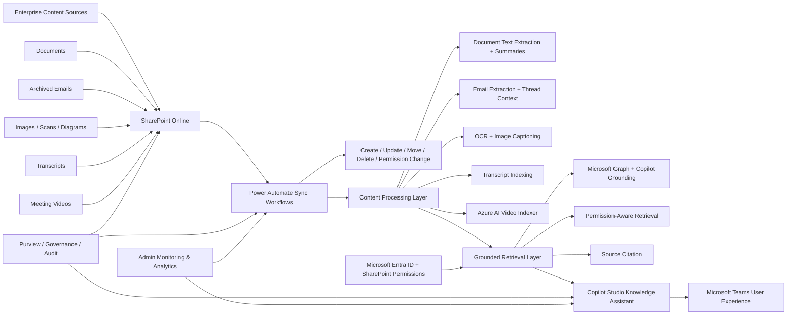

```mermaid
flowchart LR
    A["Enterprise Content Sources"] --> B["SharePoint Online"]
    A1["Documents"] --> B
    A2["Archived Emails"] --> B
    A3["Images / Scans / Diagrams"] --> B
    A4["Transcripts"] --> B
    A5["Meeting Videos"] --> B

    B --> C["Power Automate Sync Workflows"]
    C --> C1["Create / Update / Move / Delete / Permission Change"]

    C --> D["Content Processing Layer"]
    D --> D1["Document Text Extraction + Summaries"]
    D --> D2["Email Extraction + Thread Context"]
    D --> D3["OCR + Image Captioning"]
    D --> D4["Transcript Indexing"]
    D --> D5["Azure AI Video Indexer"]

    D --> E["Grounded Retrieval Layer"]
    E --> E1["Microsoft Graph + Copilot Grounding"]
    E --> E2["Permission-Aware Retrieval"]
    E --> E3["Source Citation"]

    E --> F["Copilot Studio Knowledge Assistant"]
    F --> G["Microsoft Teams User Experience"]

    H["Microsoft Entra ID + SharePoint Permissions"] --> E
    I["Purview / Governance / Audit"] --> B
    I --> C
    I --> F

    J["Admin Monitoring & Analytics"] --> C
    J --> F

```
